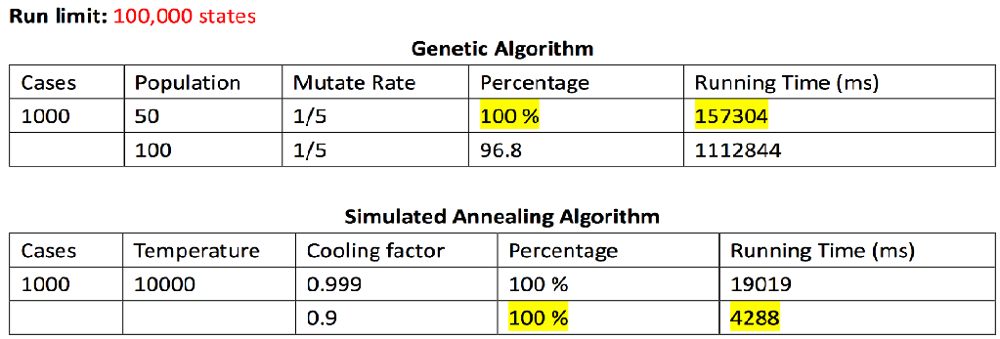

# Artificial Intelligence Game: N-queen
```
Algorithm: (1) Genetic Algorithm (2) Simulate Annealing Algorithm
```

```
File description:
  - main.java: main function for the project
  - Genetic.java : Genetic Algorithm
  - Simulated_Annealing.java: Simulate Annealing Algorithm
```

## Approach

### 1. Genetic Algorithm

- #### a. Fitness function:
  The fitness function defines how good the state is, this program calculate the non- attacking value N * ( N – 1 ) / 2 then minus 1 for each attacking pairs.

- #### b. Parent Selection:
  Every individual can become a parent with a probability which is proportional to its fitness. Therefore, the individuals which have a higher fitness value will have a higher chance of mating and propagating their features to the next generation. This process is like “Roulette Wheel Selection”.

- #### c. Crossover:
  This program used one point crossover, the process is like the figure below, randomly select a cut point then change part of the state solution.

- #### d. Mutation:
  It’s a small random tweak in the state to get a new solution with a given probability. This program used insertion mutation which randomly select a queen then randomly change the position.

- #### e. Survivor Selection :
  The Survivor Selection determines which individuals are to be kicked out and which are to be kept in the next generation. This project generate 2N new population and sort them in descending order according to their fitness value, then select the top N population to be our next generation.


### 2. Simulated Annealing

- #### a. Next state generator
  Randomly select a queen then put in the random position to be our next possible state.

- #### b. Selection function
  If the fitness value of the next state is higher than the current state, then return the next state to be our new solution, otherwise, apply a probability to decide select or not


## Analysis

  Simulated annealing algorithm works very well for solving the N queen problem, it can solve almost 100% of the random problem. If decrease the cooling factor the program will solve the problem faster, but if the cooling factor is below than 0.7, the running time begin to increase and harder to find the solution. Because the program is too early to became not taking the bad solution to get away from the local maxima.
    
  Genetic algorithm also works well on solving the N queen problem, depend on the figure above we can see if increase the population size will extremely increase the program running time. Then if let the program run less state during the process, the percentage for solving the problem decrease to 90%. Because genetic algorithm is easy to stuck in the local maxima, it needs mutation function to help the program find the solution, so need more running state.



## License

This project is licensed under the MIT License - see the [LICENSE.md](LICENSE.md) file for details

## Acknowledgments

* Author: Hank Tsou
* Contact: hank630280888@gmail.com
* Project from California State Polytechnic University, Pomona, Computer Science, CS-4200 Artificial Intelligence
